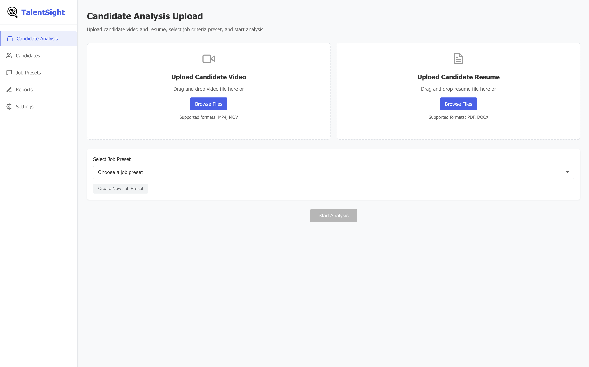
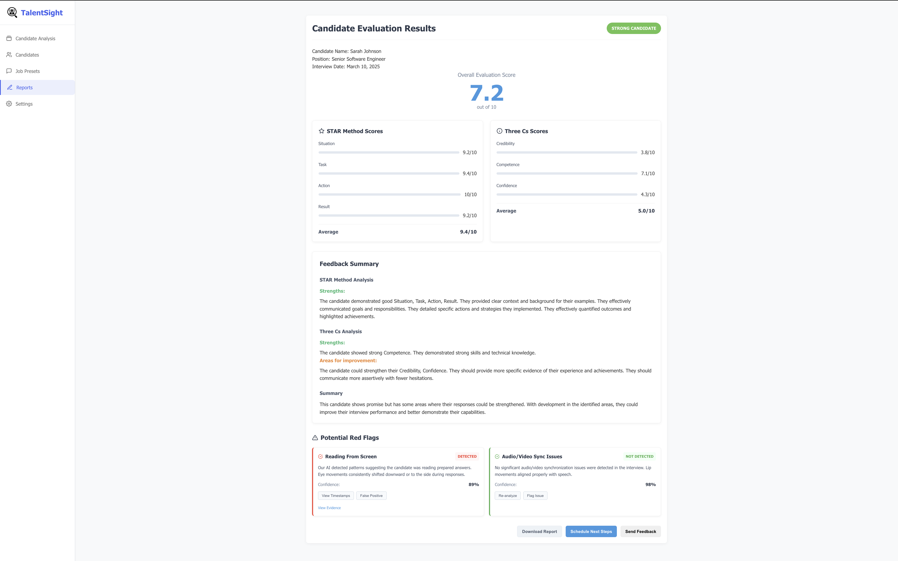

TalentSight
================
CodeStormers

03/16/2025

## Project Overview

Our AI-powered hiring solution enhances recruitment processes for
organizations by ensuring alignment between candidates and company
values and goals by leveraging on-device AI-powered video interview
analysis.


The image displays TalentSight's Candidate Analysis Upload interface. It features a sidebar menu and a central upload area with two sections: one for candidate videos (MP4/MOV) and another for resumes (PDF/DOCX). Users can drag-and-drop files or browse to select them, choose a job preset from a dropdown menu, and initiate analysis with the "Start Analysis" button at the bottom.


The image shows TalentSight's Candidate Evaluation Results page for Sarah Johnson, a Senior Software Engineer applicant. The interface displays an overall evaluation score of 7.2/10, with detailed STAR Method scores (Situation: 9.2/10, Task: 9.6/10, Action: 10/10, Result: 9.2/10) averaging 9.4/10, and Three Cs scores (Credibility: 3.8/10, Competence: 7.1/10, Confidence: 4.3/10) averaging 5.0/10. The feedback summary highlights strengths in communication and technical skills, while suggesting improvements in credibility and confidence. The page also flags that the candidate was reading from screen (detected at 89% confidence) but had no audio/video sync issues.

## Main Features:

- **Promote security and privacy** by using on-device AI instead of
  cloud-base ones.  
- **Improve hiring efficiency** by reducing time spent on candidate
  evaluation.  
- **Positive Candidate Experience** by providing feedback on their
  interview.  
- **Enhance decision-making** with structured, data-driven insights.  
- **Promote fairer hiring** by minimizing human biases in initial
  screenings.  

## Differenciates Features:

Our project utilizes on-device AI to provide job interview analysis,
which is rare in the market. Unlike existence solutions, our approach
offers:

- **On-Device AI Processing** → Ensures privacy & efficiency.
- **Offline Functionality** → Enables accessibility in low-connectivity
  regions.
- **Offline Functionality** → Improving performance for longer
  interview.
- **Positive Candidate Experience** → by providing feedback on their
  interview and.

## Existing Solutions

Some AI-powered hiring tools include:

| Tool | Features |
|----|----|
| **HireVue** | AI analyzes video interviews (speech, facial expressions, etc.). |
| **MyInterview** | NLP-based evaluation and ranking of interview responses. |
| **Pymetrics** | Behavioral and cognitive tests for talent matching. |
| **Eightfold AI** | Predicts candidate success based on experience and skills. |
| **X0PA AI** | Machine learning for bias-free hiring using interview transcripts. |

## Future Enhancements

After the initial release, potential extensions could include:

- **Live Candidate Feedback** → AI-generated insights during interviews.
- **Multilingual AI Support** → Assists global recruitment for
  multinational companies.
- **Bias Reduction Models** → Developing fair AI assessments to improve
  diversity in hiring.

## Getting Started

**1.Setting** Defining job description if it does not exists yet

**2.Job Presents**

**3.Candidates**

**4.Candidate Analysis**  
After analysis the interview video, by considering the resume and the
job description, the report of candidate analysis will be ready.

**5.Reports**

## Technical Aspects

### Implementation 

*Programming Languages:*  
- **Electron.js**  

*Database:*  
- **SQLLite**  

*Models:*  
- **Vision detection**  
- **Speech to text**  
- **PII Redaction**  
- **Transcript/ Resume analysis**  (Not fully integrated, planned for future)
- **STAR evaluation**

## Prerequisites
Ensure you have the following installed:
- [Node.js](https://nodejs.org/) (latest LTS recommended)
- [Electron](https://www.electronjs.org/)

## Prerequisites

Ensure you have the following installed:

- [Node.js](https://nodejs.org/) (latest LTS recommended)
- [Electron](https://www.electronjs.org/)

## Installation

Clone the repository and install dependencies:

```sh
git clone git@github.com:rahul-s-rajput/TalentSight.git
cd talentsight
npm install
```

Create a virtual environment for Python 3.10:

```sh
python3.10 -m venv venv
source venv/bin/activate  # On Windows use `venv\Scripts\activate`
```

Install required Python packages:

```sh
pip install -r requirements.txt
```

## Usage

Start the application as admin:

```sh
npm start
```

Package the application for Windows:

```sh
npm run packager

## File Structure
```
📂 talentsight
├── 📄 package.json  # Project metadata and scripts
├── 📄 main.js       # Main Electron process
├── 📂 dist          # Output directory for packaged app
├── 📂 node_modules  # Installed dependencies
└── 📂 other-files   # Additional project files (if any)
```

## License
This project is licensed under the MIT License.

## Author
Rahul Rajput
Melika Zandi
Jalal Mansoori
Ronald Mundell
Lawrence Dass